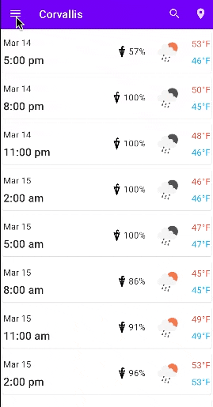

## Weather App 

This android app takes a city that the user enters, stores it in the database on the phone, and performs a query of the weather in that city. The list of searched cities is then displayed in the navigation drawer. 

